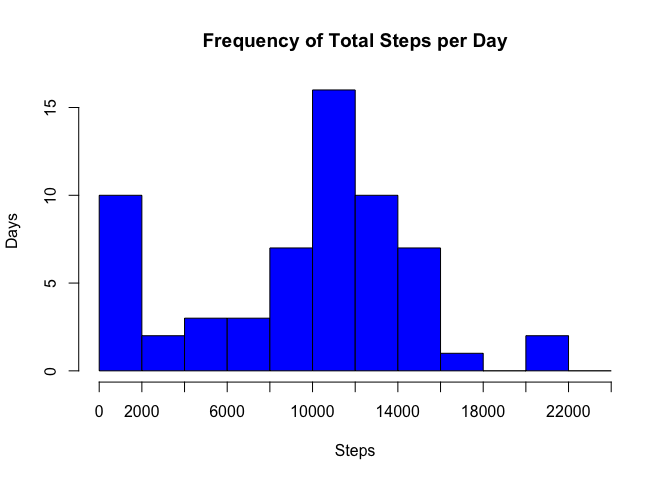
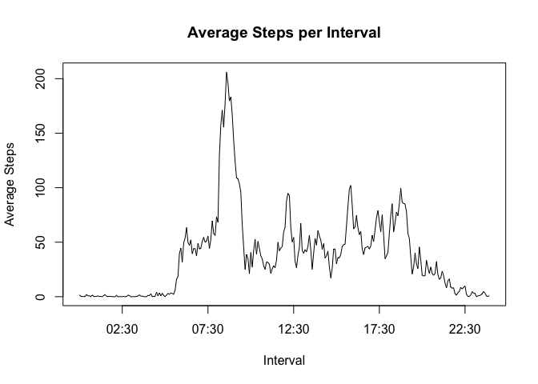
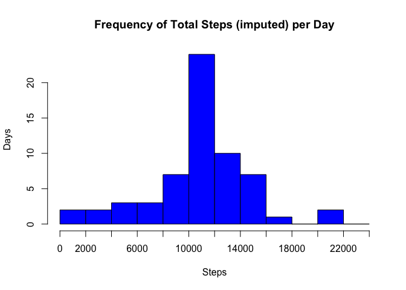
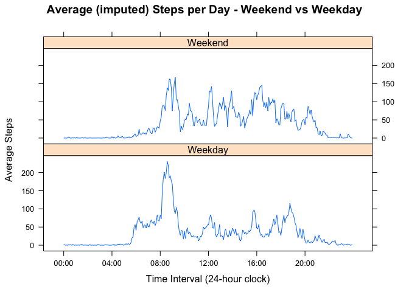

Reproducible Research Week 2: Assignment 1
==========================================

Step 1: Code for reading in the dataset and/or processing the data
------------------------------------------------------------------

Initiate required Libraries

``` r
library(lattice)
```

Creating a master file for reference

``` r
dfMaster <- read.table("activity.csv",
                       header=TRUE,
                       sep=",",
                       stringsAsFactors = FALSE,
                       colClasses = c("numeric","Date","numeric")
                      )
```

Creating the working dataframe

``` r
df <- dfMaster
```

Step 2: Histogram of the total number of steps taken each day
-------------------------------------------------------------

``` r
TotalStepsByDay <- aggregate(df$steps,list(date=df$date),sum,na.rm=TRUE)
xAxisBreakdown = seq(from=0,to=25000,by=2000) 
hist(TotalStepsByDay$x,
     breaks = xAxisBreakdown,
     main="Frequency of Total Steps per Day",
     col="blue",
     xlab="Steps",
     ylab="Days",
     xaxt="n")
axis(side=1,at=xAxisBreakdown,labels=xAxisBreakdown)
```



Step 3: Mean and median number of steps taken each day
------------------------------------------------------

Calculate and print Mean number of steps per day

``` r
stepMean <- mean(TotalStepsByDay$x,na.rm=T)
stepMedian <- median(TotalStepsByDay$x,na.rm=T)
print(paste("The Mean number of steps per day is",round(stepMean,1)))
```

    ## [1] "The Mean number of steps per day is 9354.2"

Calculte and print Median number of steps per day

``` r
print(paste("The Median number of steps per day is",round(stepMedian,1)))
```

    ## [1] "The Median number of steps per day is 10395"

Step 4: Time series plot of the average number of steps taken
-------------------------------------------------------------

Convert the 5-minute 24-hour clock intervals into a time class The hours of the interval are equal to the first two digits (interval divided by 100, with remainder tossed)

``` r
intHours <- df$interval %/% 100
```

Now add a leading 0 when the hours are one digit

``` r
intHours <- ifelse(intHours < 10,paste("0",intHours,sep=""),intHours)
```

The minutes of the interval are equal to the second two digits (the remainder after dividing by 100)

``` r
intMinutes <- df$interval %% 100
```

Now add a leading 0 when the minutes are one digit

``` r
intMinutes <- ifelse(intMinutes < 10,paste("0",intMinutes,sep=""),intMinutes)
```

Now put the minutes and hours together and convert to a time with strptime()

``` r
intTime <- paste(intHours,":",intMinutes,sep="")
intTime <- strptime(intTime,format="%H:%M")
```

Now add the time variable back into the original data set

``` r
df <- cbind(df,intTime)
```

We now have the time in the data frame as a time, so we can compute the mean number of steps for each time interval and plot the result

``` r
SPI <- aggregate(df$steps,list(intTime=df$intTime),mean,na.rm=TRUE)
plot(SPI$intTime,SPI$x,
     type = "l",
     main = "Average Steps per Interval",
     xlab = "Interval",
     ylab = "Average Steps")
```



Step 5: The 5-minute interval that, on average, contains the maximum number of steps
------------------------------------------------------------------------------------

``` r
MaxStepAvg <- max(SPI$x)
IntervalWithMaxStepAvg <- SPI$intTime[SPI$x == MaxStepAvg]
```

The highest average is equal to 206.1698113.

Step 6: Code to describe and show a strategy for imputing missing data
----------------------------------------------------------------------

### Part A: Calculate and report the number of missing values in the dataset.

``` r
countNAs <- sum(is.na(df$steps))
```

The total number of missing values are 2304

### Part B: Create a dataset that replaces NA values with the mean for that interval.

Rename column "x" in data frame SPI to what it actually represents

``` r
names(SPI)[names(SPI)=="x"] <- "avgIntervalSteps"
```

Now merge the average back into the dataframe by intTime

``` r
dfWithAvg <- merge(x=df,y=SPI,by="intTime",all.x=TRUE)
```

Reorder the new dataframe to preserve the date, interval ordering of the original file

``` r
dfWithAvg <- dfWithAvg[order(dfWithAvg$date,dfWithAvg$intTime),]
```

Create another column that uses the steps, if available, and the avgIntervalSteps otherwise.

``` r
dfWithAvg$imputedSteps <- ifelse(is.na(dfWithAvg$steps), 
                                 dfWithAvg$avgIntervalSteps,
                                 dfWithAvg$steps)
```

Step 7: Histogram of the total number of steps taken each day after missing values are imputed
----------------------------------------------------------------------------------------------

``` r
TotalStepsByDayImputed <- aggregate(dfWithAvg$imputedSteps,list(date=dfWithAvg$date),sum,na.rm=TRUE)
xAxisBreakdown = seq(from=0,to=25000,by=2000) 
hist(TotalStepsByDayImputed$x,
     breaks = xAxisBreakdown,
     main="Frequency of Total Steps (imputed) per Day",
     col="blue",
     xlab="Steps",
     ylab="Days",
     xaxt="n")
axis(side=1,at=xAxisBreakdown,labels=xAxisBreakdown)
```

 Recalculate mean

``` r
stepMeanImputed <- mean(TotalStepsByDayImputed$x,na.rm=T)
stepMedianImputed <- median(TotalStepsByDayImputed$x,na.rm=T)
print(paste("The Mean number of imputed steps per day is",round(stepMeanImputed,1)))
```

    ## [1] "The Mean number of imputed steps per day is 10766.2"

Recalculate median

``` r
print(paste("The Median number of imputed steps per day is",round(stepMedianImputed,1)))
```

    ## [1] "The Median number of imputed steps per day is 10766.2"

Step 8: Panel plot comparing the average number of steps taken per 5-minute interval across weekdays and weekends
-----------------------------------------------------------------------------------------------------------------

``` r
dfWithAvg$weekday <- weekdays(dfWithAvg$date)
dfWithAvg$weekendFlag <- ifelse(dfWithAvg$weekday=="Saturday" | 
                                  dfWithAvg$weekday=="Sunday","Weekend","Weekday")
```

Compute the average steps / day for weekend and weekdays

``` r
SPI2 <- aggregate(dfWithAvg$imputedSteps,list(
                  intTime=dfWithAvg$intTime,weekendFlag=dfWithAvg$weekendFlag),
                  mean,na.rm=TRUE)
```

Before plotting, set up the sequence to appear on the x-axis

``` r
xn <- seq(min(dfWithAvg$intTime),max(dfWithAvg$intTime),by="4 hour")
```

Draw the plot with the x-axis in HH:MM format

``` r
xyplot(x~intTime|weekendFlag,
       data=SPI2,
       type="l",
       layout=c(1,2),
       xlab = "Time Interval (24-hour clock)",
       ylab = "Average Steps",
       main = "Average (imputed) Steps per Day - Weekend vs Weekday",
       scales=list(
         x=list(
           at=xn,
           labels=format(xn,"%H:%M")
         )
       )
)
```


